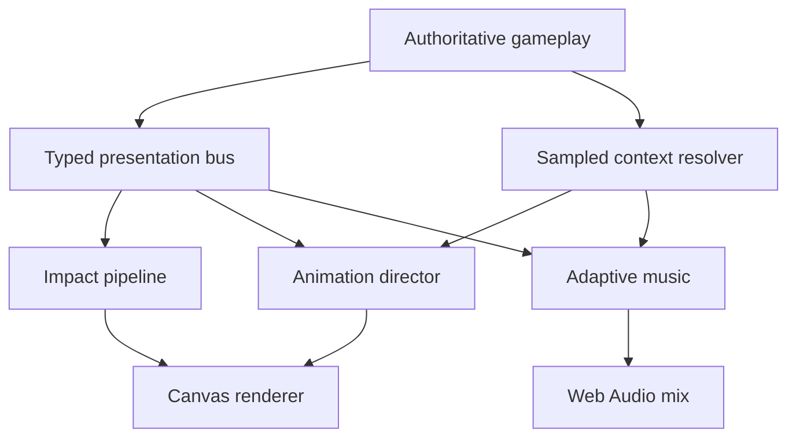

# Ashen Covenant 2.1 Presentation Architecture

## Scope and platform

Ashen Covenant is a custom JavaScript/ES-module action RPG rendered with Canvas2D and shipped in Electron 43.1.1 for Windows. It does not contain skeletal rigs, animation clips, facial bones, a physics ragdoll solver, or recorded music stems. Version 2.1 therefore implements a production-style presentation architecture using deterministic procedural poses, shared action timelines, Web Audio synthesis, existing painted atlases, and the existing authoritative simulation. Procedural score content is original but remains explicitly labeled placeholder music.

## Runtime topology

`GamePresentationSystem` owns the event bus, context resolver, animation director, impact controller, cinematic controller, settings normalization, debug telemetry, and links to `AudioDirector`. Gameplay remains authoritative for position, collision, damage, resources, cooldowns, boss phases, save state, and rewards. Presentation may delay an action until its authored release event, but it cannot invent a gameplay result.

## Event flow

The `PresentationEventBus` accepts a fixed vocabulary for context, action phases, animation events, impacts, telegraphs, boss stagger, camera, music, cinematics, loot, world transitions, and errors. Existing `GameEngine.emit` calls are retained through `legacy:*` bridges, which prevents old call sites from silently stopping while new code uses typed events.

A standard player attack flows as follows:

1. Input is buffered and checked against the current action's explicit cancel window.
2. The class attack profile starts its anticipation timeline.
3. `CommitAttack` caps facing correction and applies a bounded target alignment.
4. `PlayWeaponWhoosh` selects the weapon-specific sound profile.
5. `EnableHitbox` resolves the authoritative damage arc or projectile.
6. Damage selects an impact profile and directional reaction.
7. The shared impact pipeline applies accessible hit stop, camera impulse, controller feedback, transient VFX, audio, and an optional music accent.
8. `DisableHitbox`, recovery, and `AllowCancel` return control according to the same data record.

Primary skills, defensive fields, Companion Techniques, hybrid signatures, ultimates, potions, and executions use `CommitAction`, `PlayActionSound`, and `ResolveAction` events. Resource consumption and gameplay effects occur at `ResolveAction`, not on button press.

## Shared presentation context

`PresentationContextResolver` samples costly world information at 10 Hz, then smooths threat every frame. It records region, district, dungeon and wave, campaign state, time and weather, classes and weapon, movement/action state, health/resource pressure, combat duration, enemy/elite/boss presence, boss phase and stagger, stronghold state, cinematics, overlays, music overrides, and camera profile.

Threat combines population proximity, enemy roles, elites, boss phase and health, player danger, endgame wave, local events, and combat state. Attack/release smoothing plus threshold persistence prevents musical chatter. The state priority is narrative/cinematic, boss, death, combat, settlement, dungeon, exploration, then menu fallback. Combat remains active under paused inventory and progression overlays.

## Animation director

### Locomotion

Each class profile defines weapon, posture, weight, acceleration, deceleration, turn rate, stride rate, stride amplitude, cast gesture, and dodge style. The director resolves idle, injured idle, combat idle, start, walk, run, combat run, stop, pivot, dodge, action, reaction, death, and resurrection. Trapezoidal position integration gives equal elapsed displacement at 20 and 60 FPS. Foot contacts drive material-aware footsteps rather than timer-only samples.

Canvas2D has no bones or IK. Grounding is therefore sprite-origin grounding and stride/contact locking; the debug panel says `sprite-grounding` rather than claiming skeletal foot IK. Hand contact is expressed by class-specific procedural weapon geometry. Future skeletal assets must implement the documented interface before `Retarget Status` can move from `N/A`.

### Combat and cancellation

There are 18 class/weapon basic-attack profiles and ten shared action profiles. All carry startup, active, recovery, cancel windows, motion/rotation policy, audio/VFX/impact references, and ordered events. Basic attacks can cancel into dodge/attack/skill only during their authored windows. Ultimates and executions are committed actions. Hit stop pauses the action timeline and input-buffer aging together so release events cannot be skipped or duplicated.

### Motion authority

Locomotion, projectiles, network-sensitive movement, and all current abilities are gameplay-authoritative. Short melee alignment is limited to 22 world units for standard attacks and 34 for finishers, with at most 0.28 radians of rotation correction. Obstacle-aware skeletal motion warping is not claimed. Executions use the same bounded correction against their chosen target. Enemy and boss turns are capped by role; committed attacks reduce tracking rather than rotating perfectly with the player.

### Reactions, death, and LOD

Hit reaction selection uses direction, damage, critical state, role, boss resistance, and recent reaction history. Corpses select directional, grounded, scorched, frozen, or authored-boss profiles and use bounded visual impulse; there is no uncontrolled physics ragdoll. Animation LOD tiers classify hero, near, mid, far, and offscreen actors. Mid/far actors reduce procedural pose evaluation and offscreen actors skip unnecessary work.

## Impact and camera pipeline

Nineteen impact profiles specify hit stop, shake, flash, rumble, particle budget, and sound. Ten camera profiles cover menu, exploration, settlement, combat, elite, boss, world boss, dialogue, death, and victory. Camera zoom/follow/offset blend instead of snapping. Reduced motion, shake, impact-pause, flashing, and simplified-effect settings alter presentation without changing collision, telegraphs, or damage.

## Adaptive music and audio

`AudioDirector` creates 14 named buses plus a separate music-duck gain so dialogue/menu ducking never overwrites the user's music volume. SFX uses a 32-voice priority budget, cooldowns, spatial pan hooks, and procedural tone/noise layers. Footsteps vary surface filter, pitch, foot, weight, speed, and armor.

`AdaptiveMusicSystem` contains a cue database, history tracker, threat evaluator, quantized transition scheduler, vertical layer controller, stinger controller, mix controller, and debug state. Thirty-five cues cover seven global states, six regions × exploration/combat/dungeon, and ten bosses. The 182 synchronized procedural stem definitions include drones, texture, harmony, pulse, percussion, brass, choir, climax, depth, class color, and boss motif roles.

Transitions can occur immediately or on beat/half-bar/bar/two-bar/four-bar boundaries. Exploration uses deterministic variable silence intervals derived from region and time of day. Cue and section history penalizes repetition. Boss stagger thins the score; boss defeat crossfades the next context under a short silence. Death-to-boss restoration is immediate and does not replay the reveal sting for the same living boss.

## Cinematics, save/load, and compatibility

The cinematic controller owns start/end/skip events and music ducking. Existing campaign dialogue remains the authoritative story-state mechanism; skip completes the presentation state and leaves quest/reward mutation to the existing idempotent campaign code. This project does not contain an external Sequencer-style asset format.

Save version 13 remains unchanged. New mix/accessibility/debug preferences persist through settings storage. Action timelines, camera impulses, current procedural voices, and other transient state are rebuilt from gameplay context and are intentionally not serialized. Boss phase, campaign state, world state, rewards, and existing one-shot guards retain their prior save behavior.

## Error handling and fallbacks

Animation lookup falls back from exact profile to class-compatible, shared, then safe idle. Music falls back from exact cue to regional context, generic context, ambient, then silence. Impact, camera, and sound profiles have validated defaults. Missing audio support leaves gameplay silent without crashing. Unknown typed events are rejected in strict tests, listener failures become `presentation:error`, and the release debug panel exposes recent errors.

## Performance policy

Presentation context avoids per-frame world scans; animation LOD reduces pose work; corpses/destructibles have cleanup budgets; SFX has voice stealing; music is resident procedural synthesis with no disk streaming; and offscreen IK/cloth/ragdoll work is zero because those systems do not exist in this renderer. See `PRESENTATION_TESTING_v2.1.0.md` for measured stress results.
